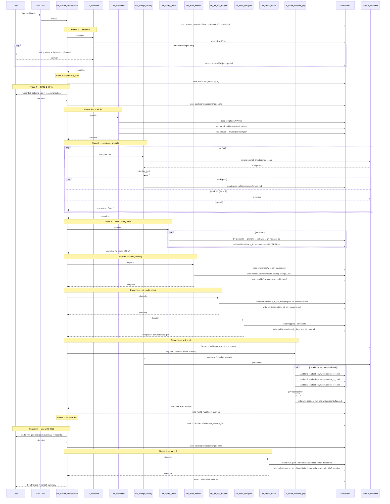

# Data flow — end-to-end

> Visualises how data moves through the 13 phases of `system-designer`. Each phase reads inputs from declared sources, emits outputs to declared targets, and signals progression through `tracking/project.json`.

## 1. High-level sequence diagram



## 2. State persistence per phase

Every phase writes to `tracking/project.json#current_phase` BEFORE returning. This makes the orchestrator resumable: if interrupted at phase N, re-invocation reads `current_phase=N` and resumes.

```
tracking/project.json
├── current_phase: "scaffold"           ← updated by phase 5 before returning
├── current_session_id: "0001"
├── completed_phases: ["read_context", "interview", "planning_brief", "GATE_1_HITL"]
├── gates_status:
│   ├── GATE_1: {status: "approved", timestamp: ...}
│   └── GATE_2: {status: "pending"}
├── artifacts_emitted: [{path, sha256, session_id, rendered_at}, ...]
├── audit_results: []  (filled by phase 10)
├── errors_seen_summary: {}  (updated by child orchestrator over time)
├── kpis_running: {}  (updated by every phase)
├── compliance: {eu_ai_act_risk, additional_regs, ...}
└── configs: {auditor_mode, auditors_count, report_standard, ...}
```

## 3. Atomic-write pattern

Every `fs.write` follows this convention:

```
1. Compute target_path (e.g., "tracking/project.json").
2. Compute tmp_path = target_path + ".tmp".
3. Write content to tmp_path.
4. Atomic rename: tmp_path → target_path.
5. (Optional) compute sha256, log to tracking/project.json#artifacts_emitted.
```

Rationale: a crash between steps 3 and 4 leaves `*.tmp` (cleanable) without corrupting the original. After step 4, the rename is atomic at the OS level — readers see either the old or the new content, never a half-written file.

## 4. HITL gate data flow

```
Phase reaches gate
  ↓
Render templates/hitl_gate.md.tmpl with:
  - alternatives [A, B, C, ...]
  - fit% per alternative (sum to 100)
  - pros / cons per alternative
  - recommendation + confidence%
  - rationale
  ↓
Present to user (LLM-runtime-specific output)
  ↓
Wait for user decision (block; no auto-skip ever)
  ↓
On decision:
  - parse letter or free-form text
  - if free-form: classify into existing alt or treat as [D]
  - log to tracking/checkpoints/gate<N>.md (atomic write)
  - log to tracking/decisions.md as ADR
  - update tracking/project.json#gates_status[GATE_N]
  ↓
Continue to next phase OR loop back if user rejected
```

## 5. Resumability flow

```
On invocation:
  1. Read SKILL.md → route to 00_master_orchestrator.md.
  2. Master orchestrator: try to read <target>/tracking/project.json.
     a. If absent → fresh start at phase 1.
     b. If present → read current_phase, completed_phases.
        - Validate state (sha256 of artifacts_emitted matches files on disk).
        - If validation passes → resume at current_phase.
        - If validation fails → halt + escalate (potential corruption).
```

## 6. Library doc fetch ladder (phase 7 detail)

```
For each library in SPEC.json#/stack:
  ┌─────────────────────────────────────────────┐
  │ Try Context7 MCP                            │
  │ mcp__context7__get_library_docs(name, ver)  │
  └────────────────────┬────────────────────────┘
                       │ fail
                       ↓
  ┌─────────────────────────────────────────────┐
  │ Try primary URL (from manifest)             │
  │ fetch(primary_url)                          │
  └────────────────────┬────────────────────────┘
                       │ fail
                       ↓
  ┌─────────────────────────────────────────────┐
  │ Try fallback URL (from manifest)            │
  │ fetch(fallback_url)                         │
  └────────────────────┬────────────────────────┘
                       │ fail
                       ↓
  ┌─────────────────────────────────────────────┐
  │ Try github_release_api (from manifest)      │
  │ fetch(api.github.com/.../releases/tags/v?)  │
  └────────────────────┬────────────────────────┘
                       │ fail
                       ↓
  ┌─────────────────────────────────────────────┐
  │ Write OFFLINE.md + log fallback             │
  │ Continue with reduced confidence            │
  └─────────────────────────────────────────────┘
```

## 7. Audit sheet write fallback ladder (phase 9 detail)

```
Try xlsx.write(path, sheets) ───────────► xlsx emitted, done
            │ unavailable
            ↓
Try csv.write(path, rows) + render sidecar .md ───► csv+md emitted, log fallback
            │ unavailable
            ↓
Try fs.write(path, json) ──────────────────► json-only, log severe portability issue, escalate
```

## 8. Auditor parallelism flow (phase 10 detail)

```
N = SystemSpec.auditors_count (default 3)
mode = SystemSpec.auditor_mode

if mode == "parallel" and parallel.spawn available:
  spawn N auditors concurrently:
    auditor_i reads audit_sheet (read-only)
    auditor_i writes audit/audits/auditor_<i>_*.md
    (auditors are blind to each other)
  wait_all

elif mode == "sequential" or parallel.spawn unavailable:
  for i in 1..N:
    auditor_i reads audit_sheet (read-only)
    auditor_i writes audit/audits/auditor_<i>_*.md
    (still blind: each only reads sheet, never others' outputs)

# All N auditor outputs ready
jury reads all N outputs
jury computes agreement matrix per row
jury flags dissents + low_confidence_consensus
jury writes audit/audits/jury_session_<id>.md

# escalations
for each row with dissent or low_confidence_consensus:
  add to escalations list
  escalations surface at Gate #2
```

## 9. KPI update flow

Every phase that finishes updates `tracking/kpis.json` and `tracking/project.json#kpis_running`:

```
On phase completion:
  duration_actual_min = now() - phase_started_at
  files_modified_count += <files_emitted_this_phase>
  tokens_consumed_estimate.range[1] += <upper_estimate>
  agent_self_confidence_pct = <self-reported>

  if errors encountered: errors_count += 1; errors_by_severity[sev] += 1
  if HITL: hitl_decisions_count += 1
  if rollback: rollbacks_count += 1
  if calibration violation detected: calibration_violations += 1
  if portability violation detected: portability_violations += 1

  atomic write tracking/kpis.json + tracking/project.json
```

## 10. End-to-end data lineage

Each child tree artifact has provenance traceable back to its source:

| Artifact | Sources | Phase |
|---|---|---|
| `<child>/SPEC.json` | user answers, `wizard/*.json` defaults | 2 |
| `<child>/PLAN.md` | `SPEC.json`, `references/*` | 3 |
| `<child>/CLAUDE.md` | `templates/CLAUDE.md.tmpl` + `SPEC.json` | 5 |
| `<child>/prompts/*.md` | `prompt_architect/SKILL.md` + role spec | 6 |
| `<child>/library_docs/*` | Context7 / primary / fallback / gh_release_api | 7 |
| `<child>/tracking/errors_catalog.json` | `references/ai_error_catalog.md` | 8 |
| `<child>/audit/eu_ai_act_mapping.md` | `references/eu_ai_act_mapping.md` + `SPEC.json` | 9 |
| `<child>/audit/audit_sheet.xlsx` | `Checklists y ejemplos/*.xlsx` + mapping doc | 9 |
| `<child>/docs/reports/*` | `references/scientific_report_format.md` + `templates/reports/*.tmpl` | 13 |
| `<child>/HANDOFF.md` | aggregation of all phases | 13 |

The sha256 of every emitted file is logged in `tracking/project.json#artifacts_emitted`, giving end-to-end reproducibility.
