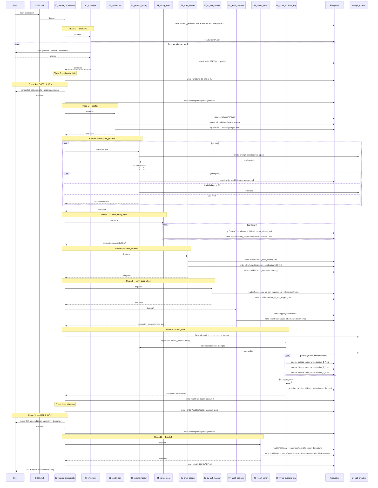
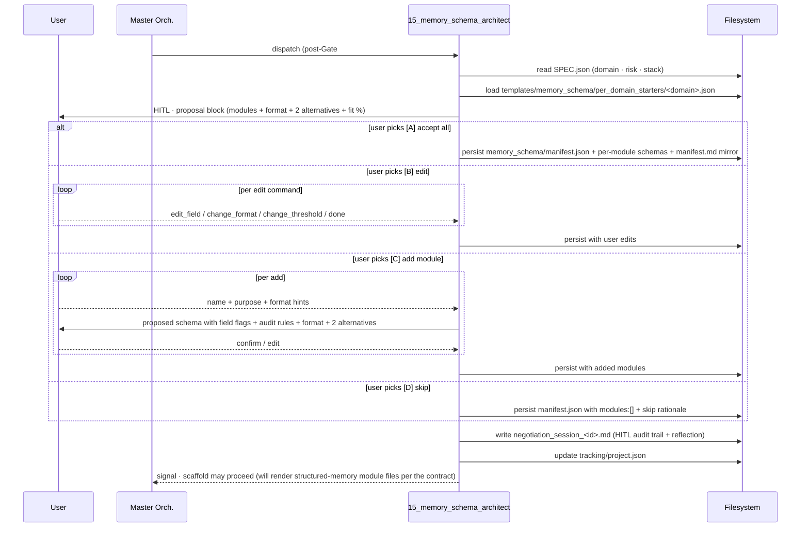
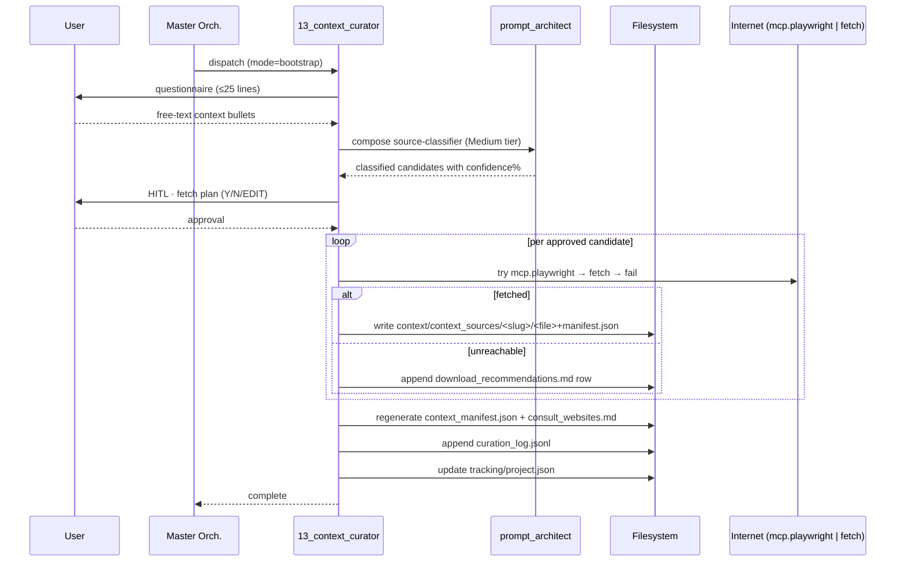

# Data flow — end-to-end

> Visualises how data moves through the **18 phases** of `system-designer` (13 base + 5 inserted at v0.2.0/v0.3.0: 1.5, 4.5, 11.5, 13.5, 13.7) plus a cross-phase adaptive audit hook. Each phase reads inputs from declared sources, emits outputs to declared targets, and signals progression through `tracking/project.json`.
>
> **v0.2.0 / v0.3.x supplement.** The original 13-phase diagram below is preserved verbatim. The 5 new phases insert at fixed points; their data flows are summarised in §11 (`v0.2.0 / v0.3.x phases supplement`) and detailed per-script in `docs/scripts/{10..15}_*.md`.

## 1. High-level sequence diagram



## 2. State persistence per phase

Every phase writes to `tracking/project.json#current_phase` BEFORE returning. This makes the orchestrator resumable: if interrupted at phase N, re-invocation reads `current_phase=N` and resumes.

```
tracking/project.json
├── current_phase: "scaffold"           ← updated by phase 5 before returning
├── current_session_id: "0001"
├── completed_phases: ["read_context", "interview", "planning_brief", "GATE_1_HITL"]
├── gates_status:
│   ├── GATE_1: {status: "approved", timestamp: ...}
│   └── GATE_2: {status: "pending"}
├── artifacts_emitted: [{path, sha256, session_id, rendered_at}, ...]
├── audit_results: []  (filled by phase 10)
├── errors_seen_summary: {}  (updated by child orchestrator over time)
├── kpis_running: {}  (updated by every phase)
├── compliance: {eu_ai_act_risk, additional_regs, ...}
└── configs: {auditor_mode, auditors_count, report_standard, ...}
```

## 3. Atomic-write pattern

Every `fs.write` follows this convention:

```
1. Compute target_path (e.g., "tracking/project.json").
2. Compute tmp_path = target_path + ".tmp".
3. Write content to tmp_path.
4. Atomic rename: tmp_path → target_path.
5. (Optional) compute sha256, log to tracking/project.json#artifacts_emitted.
```

Rationale: a crash between steps 3 and 4 leaves `*.tmp` (cleanable) without corrupting the original. After step 4, the rename is atomic at the OS level — readers see either the old or the new content, never a half-written file.

## 4. HITL gate data flow

```
Phase reaches gate
  ↓
Render templates/hitl_gate.md.tmpl with:
  - alternatives [A, B, C, ...]
  - fit% per alternative (sum to 100)
  - pros / cons per alternative
  - recommendation + confidence%
  - rationale
  ↓
Present to user (LLM-runtime-specific output)
  ↓
Wait for user decision (block; no auto-skip ever)
  ↓
On decision:
  - parse letter or free-form text
  - if free-form: classify into existing alt or treat as [D]
  - log to tracking/checkpoints/gate<N>.md (atomic write)
  - log to tracking/decisions.md as ADR
  - update tracking/project.json#gates_status[GATE_N]
  ↓
Continue to next phase OR loop back if user rejected
```

## 5. Resumability flow

```
On invocation:
  1. Read SKILL.md → route to 00_master_orchestrator.md.
  2. Master orchestrator: try to read <target>/tracking/project.json.
     a. If absent → fresh start at phase 1.
     b. If present → read current_phase, completed_phases.
        - Validate state (sha256 of artifacts_emitted matches files on disk).
        - If validation passes → resume at current_phase.
        - If validation fails → halt + escalate (potential corruption).
```

## 6. Library doc fetch ladder (phase 7 detail)

```
For each library in SPEC.json#/stack:
  ┌─────────────────────────────────────────────┐
  │ Try Context7 MCP                            │
  │ mcp__context7__get_library_docs(name, ver)  │
  └────────────────────┬────────────────────────┘
                       │ fail
                       ↓
  ┌─────────────────────────────────────────────┐
  │ Try primary URL (from manifest)             │
  │ fetch(primary_url)                          │
  └────────────────────┬────────────────────────┘
                       │ fail
                       ↓
  ┌─────────────────────────────────────────────┐
  │ Try fallback URL (from manifest)            │
  │ fetch(fallback_url)                         │
  └────────────────────┬────────────────────────┘
                       │ fail
                       ↓
  ┌─────────────────────────────────────────────┐
  │ Try github_release_api (from manifest)      │
  │ fetch(api.github.com/.../releases/tags/v?)  │
  └────────────────────┬────────────────────────┘
                       │ fail
                       ↓
  ┌─────────────────────────────────────────────┐
  │ Write OFFLINE.md + log fallback             │
  │ Continue with reduced confidence            │
  └─────────────────────────────────────────────┘
```

## 7. Audit sheet write fallback ladder (phase 9 detail)

```
Try xlsx.write(path, sheets) ───────────► xlsx emitted, done
            │ unavailable
            ↓
Try csv.write(path, rows) + render sidecar .md ───► csv+md emitted, log fallback
            │ unavailable
            ↓
Try fs.write(path, json) ──────────────────► json-only, log severe portability issue, escalate
```

## 8. Auditor parallelism flow (phase 10 detail)

```
N = SystemSpec.auditors_count (default 3)
mode = SystemSpec.auditor_mode

if mode == "parallel" and parallel.spawn available:
  spawn N auditors concurrently:
    auditor_i reads audit_sheet (read-only)
    auditor_i writes audit/audits/auditor_<i>_*.md
    (auditors are blind to each other)
  wait_all

elif mode == "sequential" or parallel.spawn unavailable:
  for i in 1..N:
    auditor_i reads audit_sheet (read-only)
    auditor_i writes audit/audits/auditor_<i>_*.md
    (still blind: each only reads sheet, never others' outputs)

# All N auditor outputs ready
jury reads all N outputs
jury computes agreement matrix per row
jury flags dissents + low_confidence_consensus
jury writes audit/audits/jury_session_<id>.md

# escalations
for each row with dissent or low_confidence_consensus:
  add to escalations list
  escalations surface at Gate #2
```

## 9. KPI update flow

Every phase that finishes updates `tracking/kpis.json` and `tracking/project.json#kpis_running`:

```
On phase completion:
  duration_actual_min = now() - phase_started_at
  files_modified_count += <files_emitted_this_phase>
  tokens_consumed_estimate.range[1] += <upper_estimate>
  agent_self_confidence_pct = <self-reported>

  if errors encountered: errors_count += 1; errors_by_severity[sev] += 1
  if HITL: hitl_decisions_count += 1
  if rollback: rollbacks_count += 1
  if calibration violation detected: calibration_violations += 1
  if portability violation detected: portability_violations += 1

  atomic write tracking/kpis.json + tracking/project.json
```

## 10. End-to-end data lineage

Each child tree artifact has provenance traceable back to its source:

| Artifact | Sources | Phase |
|---|---|---|
| `<child>/SPEC.json` | user answers, `wizard/*.json` defaults | 2 |
| `<child>/PLAN.md` | `SPEC.json`, `references/*` | 3 |
| `<child>/CLAUDE.md` | `templates/CLAUDE.md.tmpl` + `SPEC.json` | 5 |
| `<child>/prompts/*.md` | `prompt_architect/SKILL.md` + role spec | 6 |
| `<child>/library_docs/*` | Context7 / primary / fallback / gh_release_api | 7 |
| `<child>/tracking/errors_catalog.json` | `references/ai_error_catalog.md` | 8 |
| `<child>/audit/eu_ai_act_mapping.md` | `references/eu_ai_act_mapping.md` + `SPEC.json` | 9 |
| `<child>/audit/audit_sheet.xlsx` | `Checklists y ejemplos/*.xlsx` + mapping doc | 9 |
| `<child>/docs/reports/*` | `references/scientific_report_format.md` + `templates/reports/*.tmpl` | 13 |
| `<child>/HANDOFF.md` | aggregation of all phases | 13 |

The sha256 of every emitted file is logged in `tracking/project.json#artifacts_emitted`, giving end-to-end reproducibility.

## 11. v0.2.0 phases supplement

### 11.1 Insertion points (relative to the 13-phase diagram above)

```
1   read_context
1.5 context_setup            ← NEW v0.2.0 (prompts/13_context_curator.md)
2   interview
3   planning_brief
4   GATE_1
4.5 memory_schema_setup      ← NEW v0.3.0 (prompts/15_memory_schema_architect.md)
5   scaffold
6   compose_prompts
7   fetch_library_docs
8   seed_tracking
9   emit_audit_sheet
10  self_audit
11  reflection
11.5 structural_consistency  ← NEW v0.2.0 (prompts/10_data_flow_validator.md)
12  GATE_2
13  handoff
13.5 feedback_session        ← NEW v0.2.0 (prompts/11_feedback_learning_loop.md)
13.7 improvement_audit       ← NEW v0.2.0 (prompts/12_improvement_jury.md, conditional)
14  STOP

Cross-phase (fires at every task/session end):
    adaptive_audit_meta      ← NEW v0.2.0 (prompts/14_adaptive_audit_meta.md)
                               + memory_completeness_auditor MANDATORY since v0.3.0
                                 (reads memory_schema/manifest.json as audit contract)
```

### 11.1b Phase 4.5 · memory_schema_setup data-flow (v0.3.0)



### 11.2 Phase 1.5 · context_setup (bootstrap mode)



### 11.3 Phase 11.5 · structural_consistency

```mermaid
sequenceDiagram
    participant MO as Master Orch.
    participant DV as 10_data_flow_validator
    participant PA as prompt_architect
    participant V as Validators (n=3..10)
    participant SA as Simulation Agent
    participant FS as Filesystem

    MO->>DV: dispatch (after reflection, before Gate#2)
    DV->>FS: read tracking/project.json (artifacts, audit%)
    DV->>DV: compute n_validators (formula)
    DV->>FS: write data_flow_validation/sequence_snapshots/snapshot.md
    loop per validator (n_validators + 1)
        DV->>PA: compose validator/simulation prompt
        PA-->>DV: audited prompt
    end
    par parallel (or sequential fallback)
        DV->>V: dispatch each validator (read-only over child tree)
        V->>FS: write structural_consistency/validator_<n>_<persona>.md
        DV->>SA: dispatch simulation_agent
        SA->>FS: write structural_consistency/simulation_report.md (S1-S5)
    end
    DV->>FS: write structural_consistency/consolidated_report.md
    DV->>FS: update tracking/project.json#data_flow_validation
    DV-->>MO: complete (consistency_score; HITL escalations if any)
```

### 11.4 Phase 13.5 · feedback_session + Phase 13.7 · improvement_audit

```mermaid
sequenceDiagram
    participant U as User
    participant MO as Master Orch.
    participant FB as 11_feedback_learning_loop
    participant DB as corrections.db (SQLite)
    participant FS as Filesystem
    participant IJ as 12_improvement_jury
    participant PA as prompt_architect
    participant J as 5 Auditors

    MO->>FB: dispatch (after handoff, fully audited)
    FB->>U: feedback solicitation
    loop per correction (until DONE / TRIGGER)
        U-->>FB: feedback line
        FB->>FB: auto-classify (severity × category × recurrence + conf%)
        FB->>U: HITL · learn? Y/N/SKIP
        U-->>FB: keystroke
        FB->>DB: INSERT correction (parameterised; FTS5 sync)
        FB->>FS: regenerate corrections.md mirror
    end
    alt threshold reached OR TRIGGER
        FB->>FS: write improvement_proposal.md
        FB->>MO: signal phase 13.7
        MO->>IJ: dispatch (proposal_path, session_id)
        loop 5 axes
            IJ->>PA: compose auditor (Complex)
            PA-->>IJ: audited prompt
        end
        par parallel (or sequential fallback)
            IJ->>J: dispatch (regression / calibration / portability / eu_drift / memory)
            J->>FS: write improvement_audit/auditor_<n>_<axis>.md
        end
        IJ->>FS: write improvement_audit/consensus_report.md
        IJ->>U: HITL gate · [A]/[B]/[C]/[D]
        U-->>IJ: decision
        IJ->>DB: UPDATE corrections.status (transactional)
    else no trigger
        FB->>FS: write session_close_<id>.md
    end
    FB-->>MO: complete (or, if 13.7 ran, IJ-->>MO)
```

### 11.5 Cross-phase · adaptive_audit_meta (per-task / per-session)

```mermaid
sequenceDiagram
    participant Caller as Orchestrator (any phase end / task end / session end)
    participant AM as 14_adaptive_audit_meta
    participant PA as prompt_architect
    participant A as n Auditors (3..10)
    participant DB as corrections.db
    participant FS as Filesystem
    participant U as User (only if HITL)

    Caller->>AM: scope envelope (kind, id, summary, artifacts, eu_risk, touched_modules)
    AM->>AM: compute importance score → n_auditors
    loop per auditor
        AM->>PA: compose persona-tailored auditor (with KPI block)
        PA-->>AM: audited prompt
    end
    par parallel (or sequential fallback)
        AM->>A: dispatch (each auditor blind to others)
        A->>FS: write adaptive_audit/.../auditor_<i>_<persona>.md
    end
    AM->>AM: consolidate (errors path + improvements path; rules I1/I2/I3 + E1/E2)
    AM->>FS: write adaptive_audit/.../consensus.md
    AM->>DB: INSERT improvement rows (status=pending_review; learn=SKIP until 13.5)
    alt blockers OR DISSENT_HITL_NOW
        AM->>U: HITL surface ([A]/[B]/[C]/[D])
        U-->>AM: decision
    else routine queueing
        AM->>FS: silent; phase 13.5 picks up later
    end
    AM-->>Caller: signal (errors_blocking[], improvements_queued[])
```

### 11.6 Cross-component links

| New artefact | Read by | Written by |
|---|---|---|
| `context/context_manifest.json` | every downstream phase that consults the corpus; `13_context_curator` (living updates) | `13_context_curator` (atomic regenerate) |
| `data_flow_validation/.../consolidated_report.md` | Gate #2 (escalations), `12_improvement_jury` (regression baseline) | `10_data_flow_validator` |
| `feedback_learning/corrections.db` | `12_improvement_jury` (audit), `14_adaptive_audit_meta` (insert improvements), child orchestrator (recurrence detection) | `11_feedback_learning_loop`, `14_adaptive_audit_meta` |
| `improvement_audit/consensus_report.md` | post-jury HITL gate user; humans applying merge cycle | `12_improvement_jury` |
| `adaptive_audit/.../consensus.md` | `00_master_orchestrator` (blockers), `11_feedback_learning_loop` (improvements queue) | `14_adaptive_audit_meta` |
